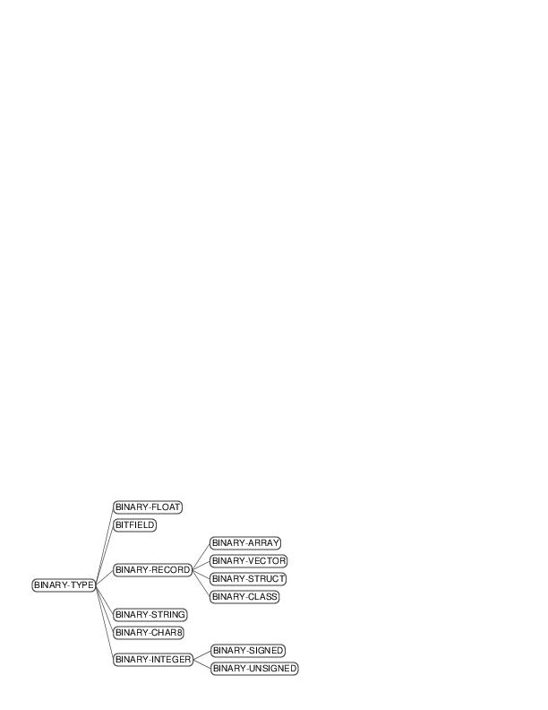

<!-- PROJECT DETAILS -->
<br />
<p align="center">
  <h3 align="center">BINARY-TYPES</h3>

  <p align="center">
  A system for declarative specification of binary file readers and writers
    <br />
    <br />
    <a href="https://github.com/snunez1/binary-types/issues">Report Bugs</a>
    ·
    <a href="https://github.com/snunez1/binary-types/issues">Request Feature</a>
    ·
    <a href="https://snunez1.github.io/binary-types/">Reference Manual</a>
  </p>
</p>


<!-- TABLE OF CONTENTS -->
<details open="open">
  <summary><h2 style="display: inline-block">Table of Contents</h2></summary>
  <ol>
    <li>
      <a href="#about-the-project">About the Project</a>
      <ul>
	    <li><a href="#objectives">Objectives</a></li>
        <li><a href="#history">History</a></li>
      </ul>
    </li>
    <li><a href="#installation">Installation</a></li>
    <li>
      <a href="#using">Using</a>
      <ul>
	    <li><a href="#declarations">Declaring classes and structures</a></li>
        <li><a href="#bitfields">Bitfields</a></li>
		<li><a href="#examples">Examples</a></li>
      </ul>
    </li>
    <li><a href="#performance">Performance</a></li>
    <li><a href="#roadmap">Roadmap</a></li>
    <li><a href="#contributing">Contributing</a></li>
    <li><a href="#license">License</a></li>
    <li><a href="#contact">Contact</a></li>
  </ol>
</details>


<!-- ABOUT THE PROJECT -->
## About the Project

BINARY-TYPES is a Common Lisp system for reading and writing binary files.  Binary-types provides macros that are used to declare the mapping between lisp objects and most binary (i.e. octet-based) representations.  Binary-types is *not* helpful in reading files with variable bit-length code-words, such as most compressed file formats. It will basically only work with file-formats based on 8-bit bytes (octets).

### Objectives

Support most kinds of binary types including:

 * Signed and unsigned integers of any octet-size, big-endian or
   little-endian. Maps to lisp integers.

 * Enumerated types based on any integer type. Maps to lisp symbols.

 * Complex bit-field types based on any integer type. Sub-fields can
   be numeric, enumerated, or bit-flags. Maps to lisp lists of symbols
   and integers.

 * Fixed-length and null-terminated strings. Maps to lisp strings.

 * Compound records of other binary types. Maps to lisp `DEFCLASS`
   classes or, when you prefer, `DEFSTRUCT` structs.

 * Vectors and arrays

 * 32 and 64 bit IEEE-754 floats map to lisp `single-float` and `double-float`.

 * NaN and infinities


### History

[BINARY-TYPES](https://github.com/frodef/binary-types) was developed over the years 1999-2003 by Frode Vatvedt Fjeld <frodef@acm.org> whilst working at the Department of Computer Science, University of Tromsø, Norway. It later served as the basis for [Chapter 24: Parsing Binary Files](https://gigamonkeys.com/book/practical-parsing-binary-files) of the book [Practical Common Lisp](https://gigamonkeys.com/book/) by Peter Seibel.  That chapter makes a good technical reference for the system, and you should read it if you want to extend BINARY-TYPES.

Frode's version was sufficiently well done that the system went largely unchanged since except for some local additions for [slitch](https://github.com/sharplispers/slitch/tree/master) a low-level networking library in 2003 and then again in a [fork by Olof-Joachim Frahm](https://github.com/Ferada/binary-types/commits/master/) in 2013 that added 128 and 256 bit integers.

This repository began in 2024 and adds support for 32/64 bit IEEE-754 floats, binary arrays, a test framework, improved documentation and refactored the repository/ASDF system.


<!-- INSTALLATION -->
## Installation

This version of BINARY-TYPES is not the official QuickLisp version, so to install it you'll need to clone the source code.

To make the system accessible to [ASDF](https://common-lisp.net/project/asdf/) (a build facility, similar to `make` in the C world), clone the repository in a directory ASDF knows about.  By default the `common-lisp` directory in your home directory is known. Create this if it doesn't already exist and then:

1. Clone the repositories
```sh
cd ~/common-lisp && \
git clone https://github.com/snunez1/binary-types.git
```
2. Reset the ASDF source-registry to find the new system (from the REPL)
   ```lisp
   (asdf:clear-source-registry)
   ```
3. Load the system
   ```lisp
   (asdf:load-system :binary-types)
   ```

If you have installed the slime ASDF extensions, you can invoke this with a comma (',') from the slime REPL.


## Who uses?
`binary-types` is used by several systems, including:

* [slitch](https://github.com/sharplispers/slitch), a low-level networking library
* [live-control](https://github.com/cbaggers/live-control), a way to fire data from your phone/tablet to your desktop
* [lispcap](https://github.com/marcmos/lispcap), passive L2 ARP host tracker with ARP request query feature
* [gdb-remote](https://github.com/deepfire/gdb-remote)
* [cl-websocket](https://github.com/Frechmatz/cl-websocket), a WebSocket-Server implemented in Common Lisp
* [cl-evdev](https://github.com/jtgans/cl-evdev), a simple driver for teasing out events from Linux’s /dev/input drivers
* [ovomorph](https://github.com/hanshuebner/ovomorph), an I/O-server for vintage computers
* [cl-gypsum-client](https://github.com/jtgans/cl-gypsum-client), a client for the [http://www.github.com/jtgans/gypsum](Gypsum) protocol
* [cl-lass](https://github.com/jl2/cl-las), library to read LAS Lidar files


<!-- Using -->
## Using
Typically, a complete binary record format/type can be specified in a single (nested) declaration statement. Such compound records may then be read and written with `READ-BINARY` and `WRITE-BINARY`.  So start with the specification for the binary file or stream and map each element.  Here's a simple example to take the first two bytes of a file:
```lisp
(define-binary-struct llama-config ()
  (dim        nil :binary-type u32)
  (hidden-dim nil :binary-type u32))
```
and, with that, we can read and print from the binary file with:
```lisp
(let ((binary-types:*endian* :little-endian))
  (with-binary-file (stream #P"stories15M.bin" :direction :input)
    (let ((config (read-binary 'llama-config stream)))
      (format t "~A~%~A"
	      (slot-value config 'dim)
	      (slot-value config 'hidden-dim)))))
```

(Note: this isn't really the on-disk format for a llama LLM checkpoint, it's just an example for demonstration purposes.

Also see [Chapter 24: Parsing Binary Files](https://gigamonkeys.com/book/practical-parsing-binary-files) for an extended example.

### Declaring classes and structures
Binary types may be declared with the `DEFINE-BINARY-CLASS` macro, which has the same syntax and semantics as `DEFCLASS`, only there is an additional slot-option (named `:BINARY-TYPE`) that declares that slot's binary type. Note that the binary aspects of slots are *not* inherited (the semantics of inheriting binary slots is unspecified).

Another slot-option added by BINARY-TYPES is `:MAP-BINARY-WRITE`, which
names a function (of two arguments) that is applied to the slot's
value and the name of the slot's binary-type in order to obtain the
value that is actually passed to `WRITE-BINARY`. Similarly,
`:MAP-BINARY-READ` takes a function that is to be applied to the binary
data and type-name when a record of that type is being read.  A
slightly modified version of `:map-binary-read` is
`:MAP-BINARY-READ-DELAYED`, which will do essentially the same thing as
`:MAP-BINARY-READ`, only the mapping will be "on-demand": A slot-unbound
method will be created for this purpose.

A variation of the `:BINARY-TYPE` slot-option is `:BINARY-LISP-TYPE`,
which does everything `:BINARY-TYPE` does, but also passes on a `:TYPE`
slot-option to `DEFCLASS` (or `DEFSTRUCT`).  The type-spec is inferred
from the binary-type declaration.  When using this mechanism, you
should be careful to always provide a legal value in the slot (as you
must always do when declaring slots' types).  If you find this
confusing, just use `:BINARY-TYPE`.




### Bitfields

> My only problem is with DEF-BITFIELD. All other BINARY-TYPES
> features are intuitive and easy to use.

`DEF-BITFIELD`, because it isn't an oft-seen paradigm, can be confusing. I think that's because it's a bit complex and it's going to take some more using it to make certain it is the way it should be.

Basically `DEF-BITFIELD` divides a numeric base-type (typically an unsigned integer) into a number of fields, where each field is one of `:BITS` for bitmaps, `:ENUM` for an enumerated field (takes an optional `:BYTE <bytespec>`), and finally `:NUMERIC <byte-size> <byte-pos>` for a subfield that is a number.

Here are a couple of examples:

```lisp
(define-bitfield r-info (u32)
              (((:enum :byte (8 0))
                 r-386-none     0
                 r-386-32       1
                 r-386-pc32     2
                 r-386-got32    3
                 r-386-plt32    4
                 r-386-copy     5
                 r-386-glob-dat 6
                 r-386-jmp-slot 7
                 r-386-relative 8
                 r-386-gotoff   9
                 r-386-gotpc    10)
                ((:numeric r-sym 24 8))))
```
This declares `R-INFO` to be an unsigned 32-bit number, divided into two
fields. The first field resides in bits 0-7, and is one of the values
r-386-xx. The second field is a numeric value that resides in bits
8-23. So this type `R-INFO` may for example have symbolic value
(r-386-pc32 (r-sym . 1)), which translates to a numeric value of
 (logior 2 1<<8)) = 258.

Another example:
```lisp
(define-bitfield p-flags (u8)
                (((:bits)
                  pf-x 0
                  pf-w 1
                  pf-r 2)))
```
Here `P-FLAGS` has just one bit-field, where bit 0 is named PF-X, bit 1
is named PF-W etc. So the value `(PF-X PF-R)` maps to 5.


### Examples
The included file "example.lisp" demonstrates how to use this
package. To give you a taste of what it looks like, the following
declarations are enough to read the header of an ELF executable file
with the form

```lisp
(let ((*endian* :big-endian))
  (read-binary 'elf-header stream)

;;; ELF basic type declarations
(define-unsigned word 4)
(define-signed sword  4)
(define-unsigned addr 4)
(define-unsigned off  4)
(define-unsigned half 2)

;;; ELF file header structure
(define-binary-class elf-header ()
  ((e-ident
    :binary-type (define-binary-struct e-ident ()
           (ei-magic nil :binary-type
                 (define-binary-struct ei-magic ()
                   (ei-mag0 0 :binary-type u8)
                   (ei-mag1 #\null :binary-type char8)
                   (ei-mag2 #\null :binary-type char8)
                   (ei-mag3 #\null :binary-type char8)))
           (ei-class nil :binary-type
                 (define-enum ei-class (u8)
                   elf-class-none 0
                   elf-class-32   1
                   elf-class-64   2))
           (ei-data nil :binary-type
                (define-enum ei-data (u8)
                  elf-data-none 0
                  elf-data-2lsb 1
                  elf-data-2msb 2))
           (ei-version 0 :binary-type u8)
           (padding nil :binary-type 1)
           (ei-name "" :binary-type
                (define-null-terminated-string ei-name 8))))
   (e-type
    :binary-type (define-enum e-type (half)
           et-none 0
           et-rel  1
           et-exec 2
           et-dyn  3
           et-core 4
           et-loproc #xff00
           et-hiproc #xffff))
   (e-machine
    :binary-type (define-enum e-machine (half)
           em-none  0
           em-m32   1
           em-sparc 2
           em-386   3
           em-68k   4
           em-88k   5
           em-860   7
           em-mips  8))
   (e-version   :binary-type word)
   (e-entry     :binary-type addr)
   (e-phoff     :binary-type off)
   (e-shoff     :binary-type off)
   (e-flags     :binary-type word)
   (e-ehsize    :binary-type half)
   (e-phentsize :binary-type half)
   (e-phnum     :binary-type half)
   (e-shentsize :binary-type half)
   (e-shnum     :binary-type half)
   (e-shstrndx  :binary-type half)))
```

## Performance
Performance has not really been a concern while designing this
system. There's no obvious performance bottlenecks that we are aware of,
but keep in mind that all "binary" reads and writes are reduced to
individual 8-bit `READ-BYTE`s and `WRITE-BYTE`s. If you do identify
particular performance bottlenecks, please raise an issue.


<!-- ROADMAP -->
## Roadmap
BINARY-TYPES is more or less feature complete.  The only feature I have encountered, once, that wasn't handled is serialized hash-maps.

See the [open issues](https://github.com/snunez1/binary-types/issues) for a list of proposed features (and known issues).


<!-- CONTRIBUTING -->
## Contributing

Contributions are what make the open source community such an amazing place to be learn, inspire, and create. Any contributions you make are **greatly appreciated**. Please see [CONTRIBUTING](CONTRIBUTING.md) for details on the code of conduct, and the process for submitting pull requests.

<!-- LICENSE -->
## License

Distributed under the BSD-3-Clause License. See [LICENSE](LICENSE) for more information.


<!-- CONTACT -->
## Contact

Project Link: [https://github.com/snunez1/binary-types](https://github.com/snunez1/binary-types)

